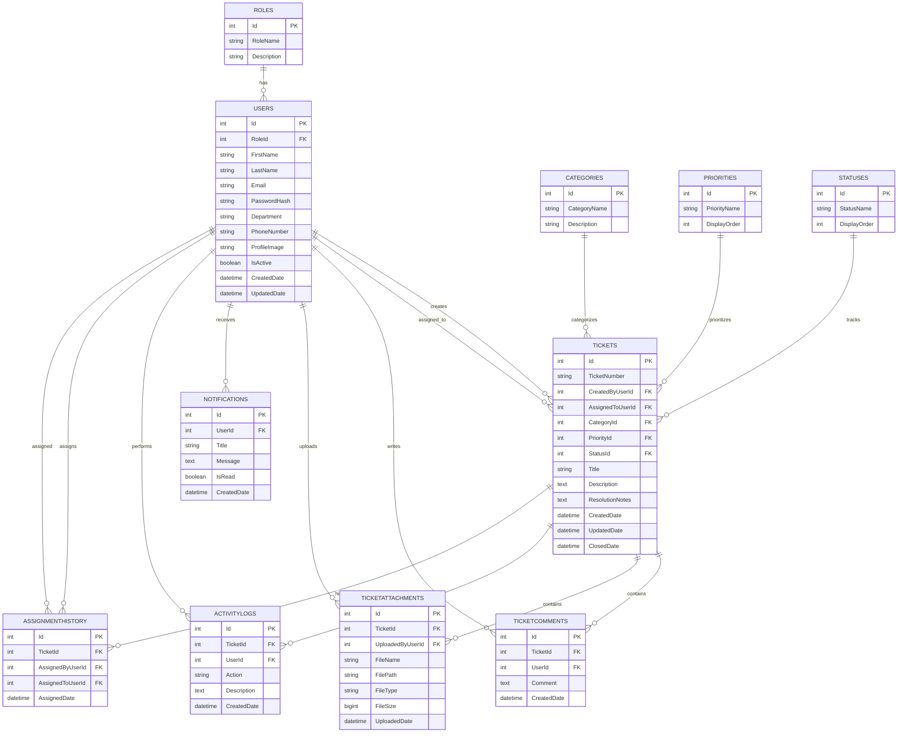

# IT Help Desk Database ERD

```mermaid
erDiagram

    ROLES ||--o{ USERS : has

    USERS ||--o{ TICKETS : creates
    USERS ||--o{ TICKETS : assigned_to
    USERS ||--o{ TICKETCOMMENTS : writes
    USERS ||--o{ TICKETATTACHMENTS : uploads
    USERS ||--o{ NOTIFICATIONS : receives
    USERS ||--o{ ACTIVITYLOGS : performs
    USERS ||--o{ ASSIGNMENTHISTORY : assigns
    USERS ||--o{ ASSIGNMENTHISTORY : assigned

    CATEGORIES ||--o{ TICKETS : categorizes
    PRIORITIES ||--o{ TICKETS : prioritizes
    STATUSES ||--o{ TICKETS : tracks

    TICKETS ||--o{ TICKETCOMMENTS : contains
    TICKETS ||--o{ TICKETATTACHMENTS : contains
    TICKETS ||--o{ ACTIVITYLOGS : records
    TICKETS ||--o{ ASSIGNMENTHISTORY : history

    ROLES {
        int Id PK
        string RoleName
        string Description
    }

    USERS {
        int Id PK
        int RoleId FK
        string FirstName
        string LastName
        string Email
        string PasswordHash
        string Department
        string PhoneNumber
        string ProfileImage
        boolean IsActive
        datetime CreatedDate
        datetime UpdatedDate
    }

    CATEGORIES {
        int Id PK
        string CategoryName
        string Description
    }

    PRIORITIES {
        int Id PK
        string PriorityName
        int DisplayOrder
    }

    STATUSES {
        int Id PK
        string StatusName
        int DisplayOrder
    }

    TICKETS {
        int Id PK
        string TicketNumber
        int CreatedByUserId FK
        int AssignedToUserId FK
        int CategoryId FK
        int PriorityId FK
        int StatusId FK
        string Title
        text Description
        text ResolutionNotes
        datetime CreatedDate
        datetime UpdatedDate
        datetime ClosedDate
    }

    TICKETCOMMENTS {
        int Id PK
        int TicketId FK
        int UserId FK
        text Comment
        datetime CreatedDate
    }

    TICKETATTACHMENTS {
        int Id PK
        int TicketId FK
        int UploadedByUserId FK
        string FileName
        string FilePath
        string FileType
        bigint FileSize
        datetime UploadedDate
    }

    NOTIFICATIONS {
        int Id PK
        int UserId FK
        string Title
        text Message
        boolean IsRead
        datetime CreatedDate
    }

    ACTIVITYLOGS {
        int Id PK
        int TicketId FK
        int UserId FK
        string Action
        text Description
        datetime CreatedDate
    }

    ASSIGNMENTHISTORY {
        int Id PK
        int TicketId FK
        int AssignedByUserId FK
        int AssignedToUserId FK
        datetime AssignedDate
    }
```
