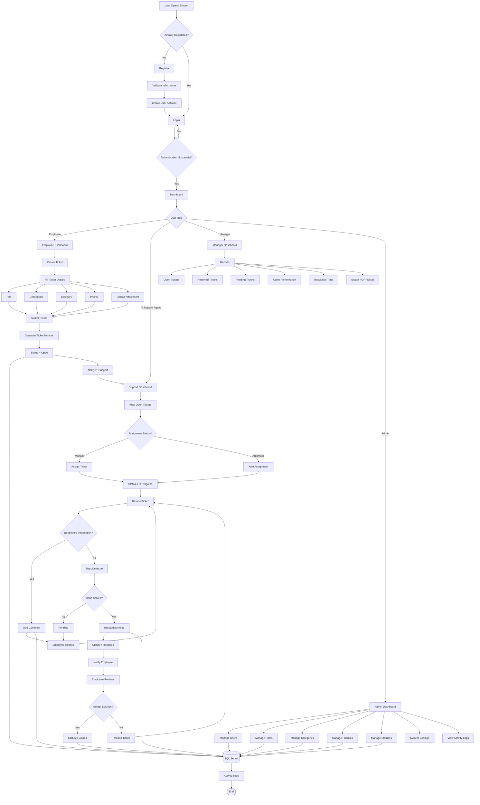

# IT Help Desk System Workflow

This workflow represents the complete lifecycle of the IT Help Desk & Ticketing Management System.

```mermaid
flowchart TD

A[User Opens System]

A --> B{Already Registered?}

B -->|No| C[Register]
C --> D[Validate Information]
D --> E[Create User Account]

B -->|Yes| F[Login]

E --> F

F --> G{Authentication Successful?}

G -->|No| F
G -->|Yes| H[Dashboard]

H --> I{User Role}

I -->|Employee| EMP
I -->|IT Support Agent| AGENT
I -->|Manager| MANAGER
I -->|Admin| ADMIN

%% Employee
EMP[Employee Dashboard]
EMP --> C1[Create Ticket]
C1 --> C2[Fill Ticket Details]
C2 --> C3[Title]
C2 --> C4[Description]
C2 --> C5[Category]
C2 --> C6[Priority]
C2 --> C7[Upload Attachment]

C3 --> C8[Submit Ticket]
C4 --> C8
C5 --> C8
C6 --> C8
C7 --> C8

C8 --> C9[Generate Ticket Number]
C9 --> C10[Status = Open]
C10 --> DB[(SQL Server)]
C10 --> N1[Notify IT Support]

%% Agent
AGENT[Support Dashboard]
N1 --> AGENT
AGENT --> A1[View Open Tickets]
A1 --> A2{Assignment Method}

A2 -->|Manual| A3[Assign Ticket]
A2 -->|Automatic| A4[Auto Assignment]

A3 --> A5
A4 --> A5

A5[Status = In Progress]
A5 --> A6[Review Ticket]

A6 --> A7{Need More Information?}

A7 -->|Yes| A8[Add Comment]
A8 --> EMP2[Employee Replies]
EMP2 --> A6

A7 -->|No| A9[Resolve Issue]

A9 --> A10{Issue Solved?}

A10 -->|No| A11[Pending]
A11 --> EMP2

A10 -->|Yes| A12[Resolution Notes]
A12 --> A13[Status = Resolved]
A13 --> N2[Notify Employee]

N2 --> E1[Employee Reviews]

E1 --> E2{Accept Solution?}

E2 -->|Yes| A14[Status = Closed]
E2 -->|No| A15[Reopen Ticket]

A15 --> A6

%% Manager
MANAGER[Manager Dashboard]
MANAGER --> M1[Reports]
M1 --> M2[Open Tickets]
M1 --> M3[Resolved Tickets]
M1 --> M4[Pending Tickets]
M1 --> M5[Agent Performance]
M1 --> M6[Resolution Time]
M1 --> M7[Export PDF / Excel]

%% Admin
ADMIN[Admin Dashboard]
ADMIN --> AD1[Manage Users]
ADMIN --> AD2[Manage Roles]
ADMIN --> AD3[Manage Categories]
ADMIN --> AD4[Manage Priorities]
ADMIN --> AD5[Manage Statuses]
ADMIN --> AD6[System Settings]
ADMIN --> AD7[View Activity Logs]

%% Database
A8 --> DB
A12 --> DB
A14 --> DB
AD1 --> DB
AD2 --> DB
AD3 --> DB
AD4 --> DB
AD5 --> DB

DB --> LOG[Activity Logs]
LOG --> END([End])
```

---

